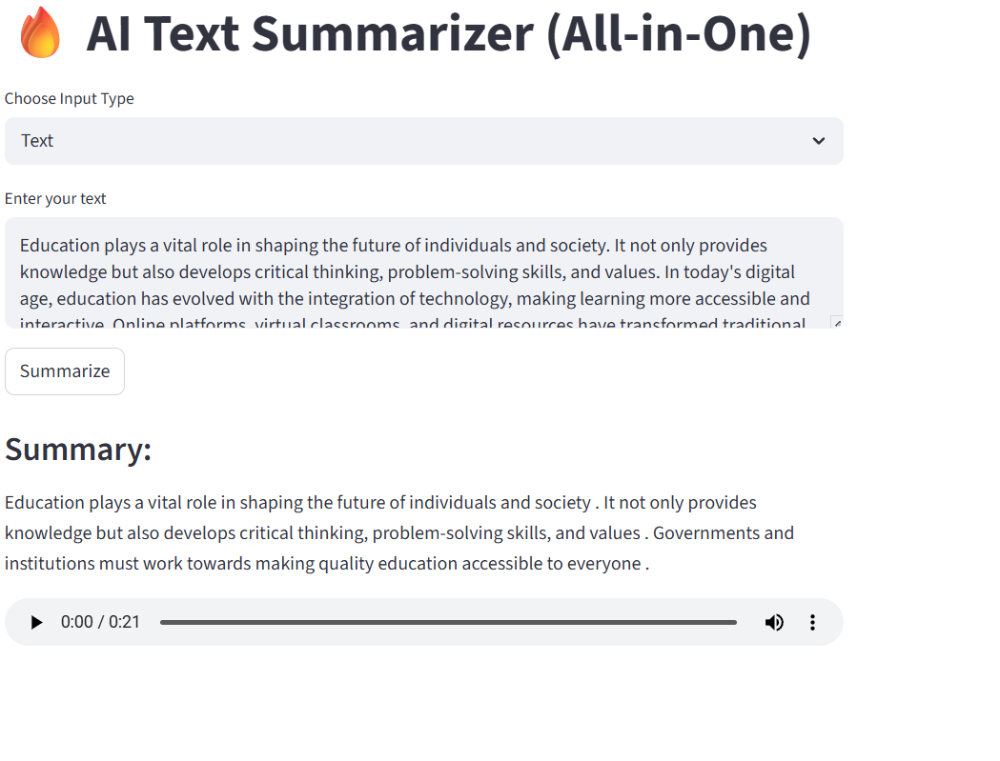

# 🚀 AI MULTI Text Summarizer

An AI-powered web application that summarizes long text,pdf,youtube videos,images into concise and meaningful content using Natural Language Processing (NLP).

---

## 📌 Project Overview

This project is a simple and efficient **Text Summarization Tool** built using Python and modern NLP techniques. It allows users to input large chunks of text and instantly get a shorter, meaningful summary.

---

## 🛠️ Tech Stack

* **Python**
* **Streamlit**
* **Hugging Face Transformers**
* **Torch**

---

## ✨ Features

* 🔹 Summarizes long paragraphs into short text
* 🔹 Clean and user-friendly interface
* 🔹 Fast processing using pre-trained NLP models
* 🔹 Works locally with minimal setup

---

## 📸 Demo



---

## ⚙️ How to Run Locally

1. Clone the repository:

```
git clone https://github.com/your-username/your-repo-name.git
```

2. Navigate to the project folder:

```
cd your-repo-name
```

3. Install dependencies:

```
pip install -r requirements.txt
```

4. Run the app:

```
streamlit run app.py
```

---

## 🧠 What I Learned

* Understanding how NLP models work
* Using Hugging Face pipelines for real-world applications
* Building interactive apps using Streamlit
* Debugging deployment issues and handling dependencies

---

## 🚧 Current Status

* ✅ Application works locally
* ⚙️ Deployment in progress (learning and improving)

---

## 🔮 Future Improvements

* Improve UI/UX design
* Add multiple summarization models
* Deploy the app for public access
* Add file upload (PDF/Text) feature

---

## 🤝 Connect with Me

If you liked this project or have suggestions, feel free to connect!

* LinkedIn: *[Add your LinkedIn link]*
* GitHub: *[Add your GitHub link]*

---

## ⭐ Show Your Support

If you found this project useful, please give it a ⭐ on GitHub!

---
